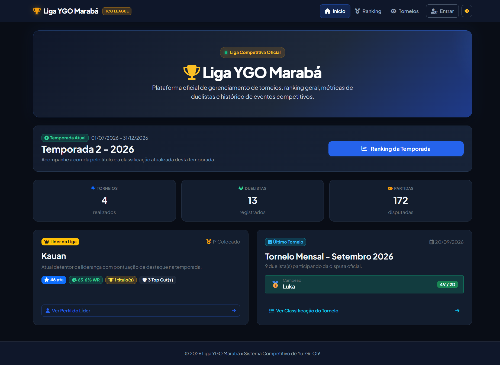
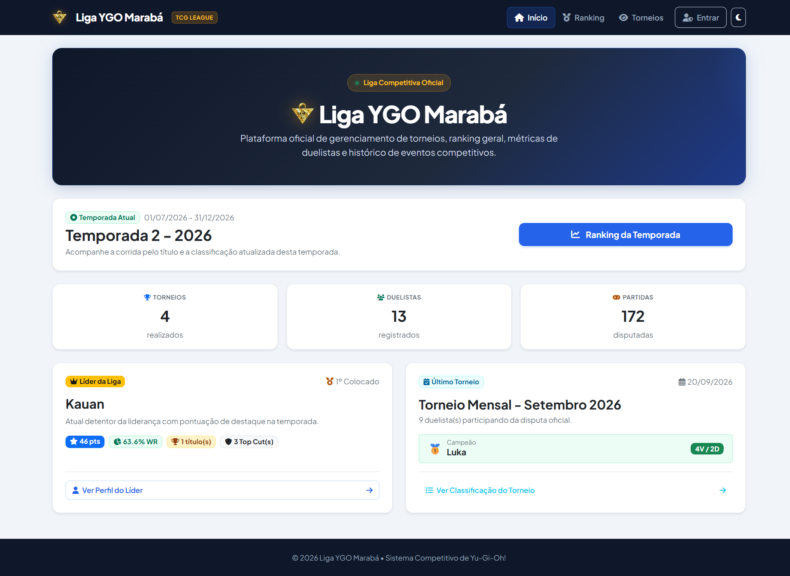
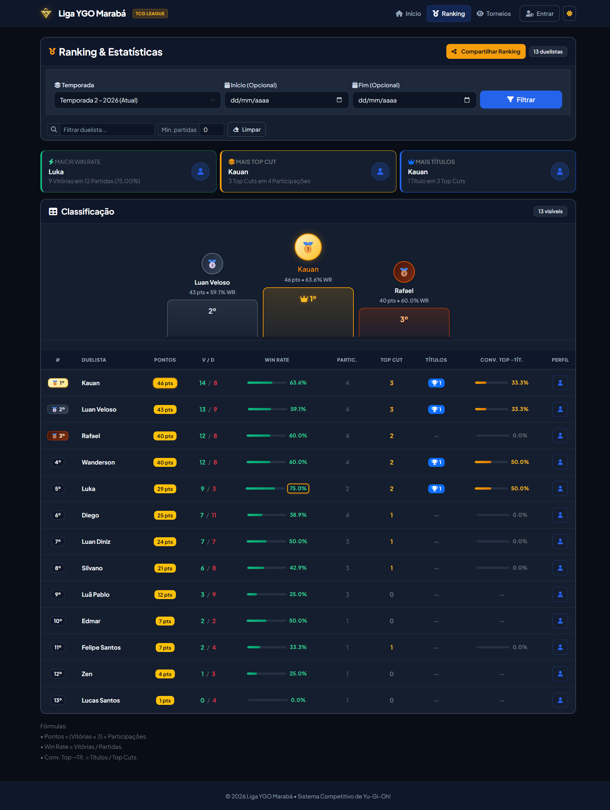
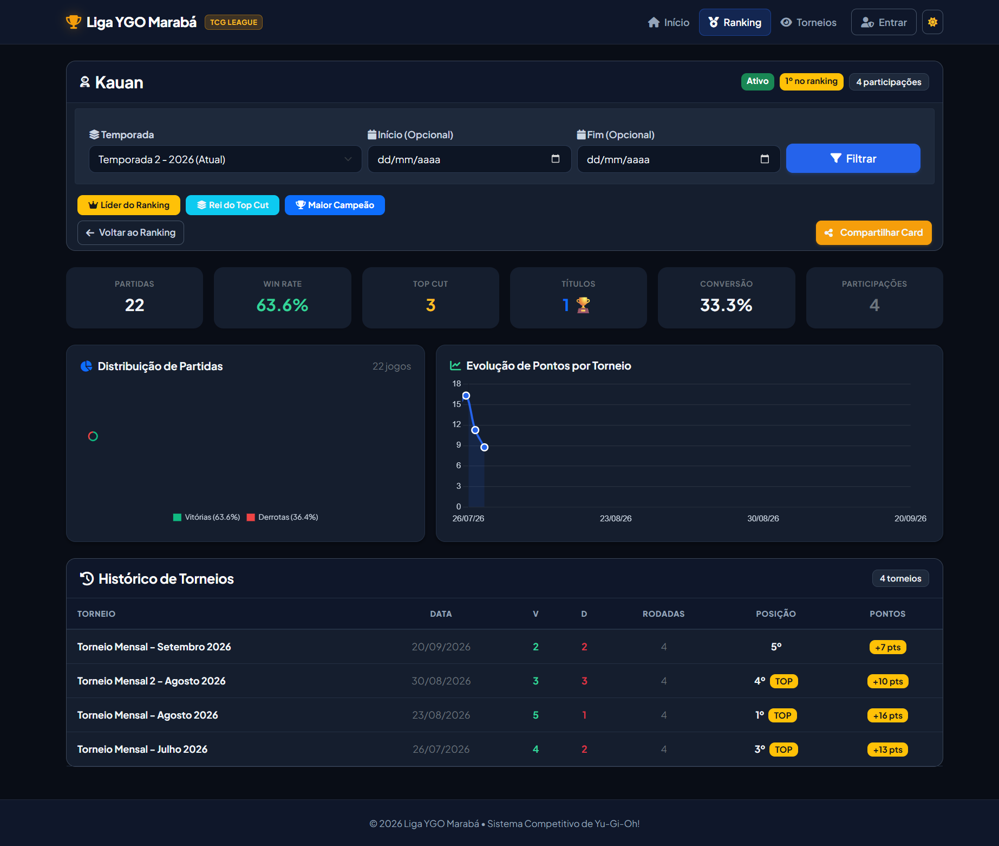
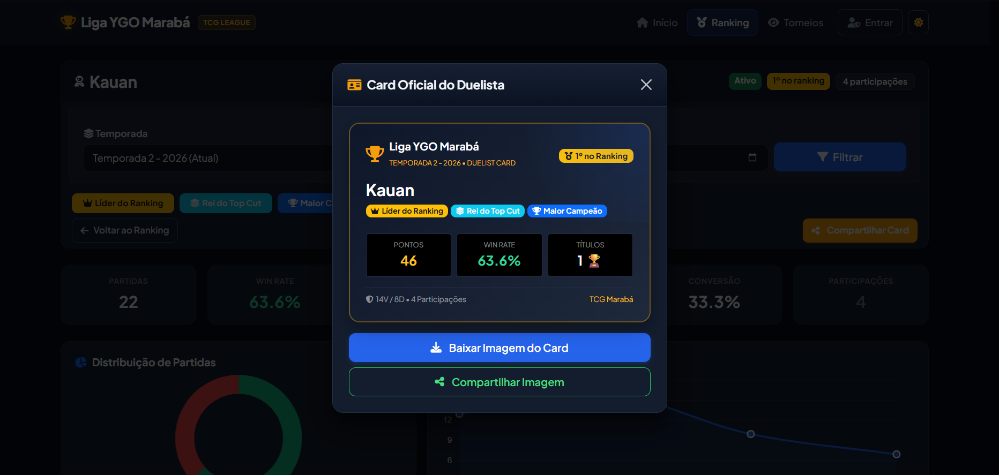
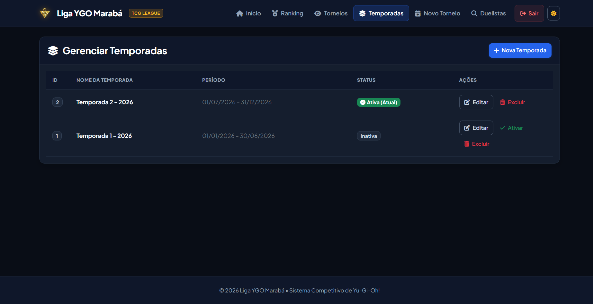
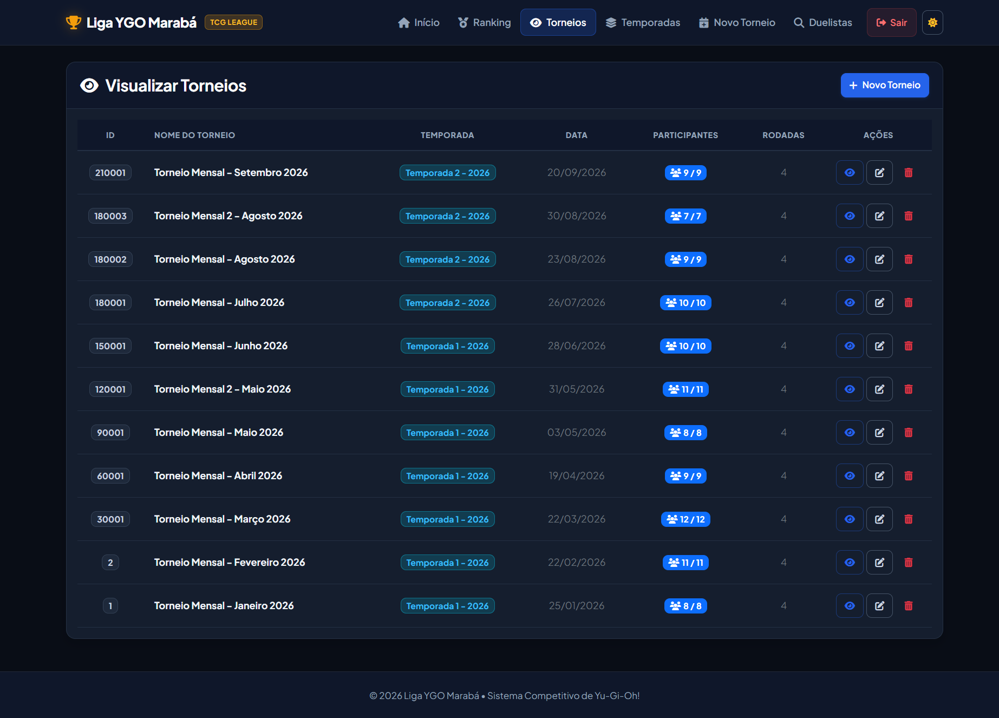
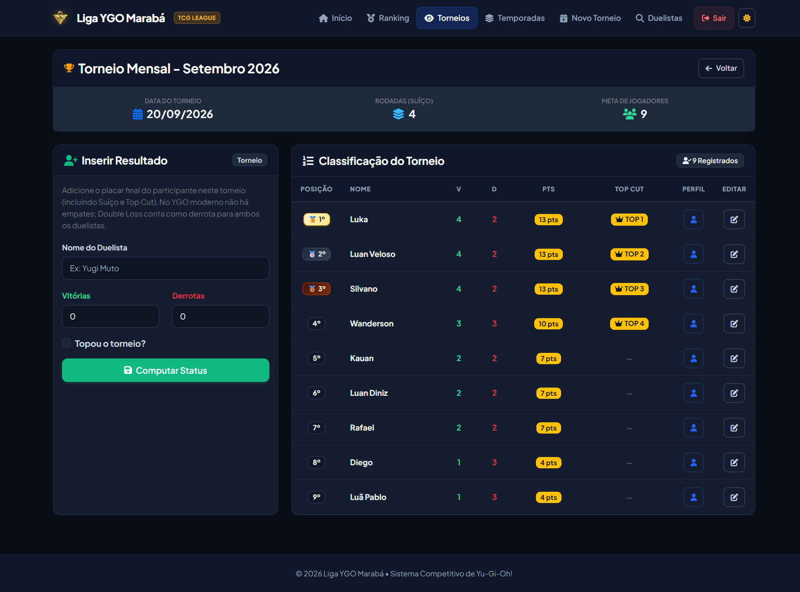
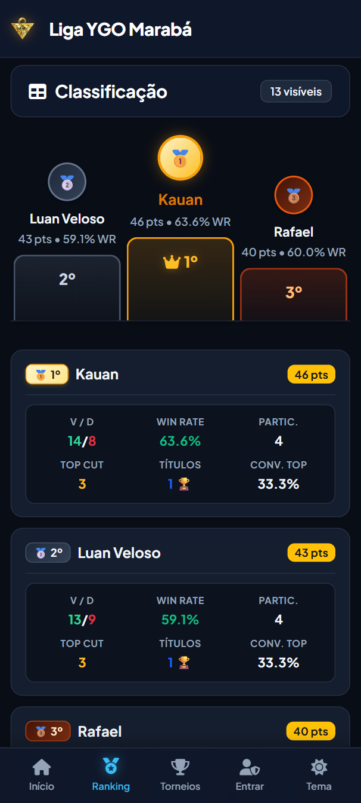
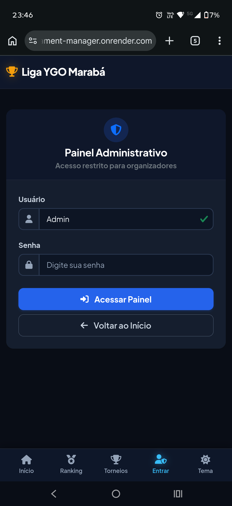

<p align="center">
  <a href="https://ygo-tournament-manager.onrender.com" target="_blank" rel="noopener noreferrer">
    
  </a>
</p>

<h1 align="center">Liga YGO Marabá — Tournament Manager</h1>

<p align="center">
  <strong>Plataforma web determinística de alta performance para gestão de torneios competitivos de Yu-Gi-Oh!, com ranking dinâmico, estatísticas avançadas e design mobile-first.</strong>
</p>

<p align="center">
  <a href="https://ygo-tournament-manager.onrender.com"></a>
  
  
  
  
  
  
</p>

<p align="center">
  <a href="https://ygo-tournament-manager.onrender.com">
    
  </a>
</p>

<p align="center">
  <sub>Monitoramento de infraestrutura: <a href="https://ygo-tournament-manager.onrender.com/health"><code>/health</code></a> (Health Check Endpoint &mdash; HTTP 200 OK)</sub>
</p>

---

## 🎯 Por Que Este Projeto Existe? (Contexto de Engenharia)

Historicamente, comunidades e lojas locais de jogos de cartas colecionáveis (TCG) dependem de planilhas manuais, anotações de papel ou softwares legados para organizar torneios. Essa abordagem apresenta gargalos severos de confiabilidade:

* **Erros de Cálculo e Inconsistência:** Desempates manuais, regras de pontuação aplicadas equivocadamente e fórmulas sujeitas a falhas humanas de digitação.
* **Perda de Memória Histórica:** Ausência de persistência longitudinal do desempenho de duelistas ao longo de múltiplos torneios e temporadas.
* **Complexidade na Aplicação de Regras Oficiais:** Dificuldade de modelar fielmente a regra oficial de **Double Loss** da Konami, que bane empates no formato competitivo moderno.
* **Experiência Móvel Inexistente:** Dificuldade para jogadores consultarem pareamentos, pódios e classificações em tempo real diretamente em seus smartphones durante o calor das rodadas.

O **Liga YGO Marabá — Tournament Manager** foi projetado para solucionar esses problemas como um sistema web determinístico, escalável e de baixa latência, transformando a gestão de torneios locais em uma experiência competitiva de nível profissional.

---

## 🏛️ Pilares de Engenharia & Algoritmos

```
   ┌──────────────────────────────────────────────────────────┐
   │                   Web Tier (Flask / Jinja2)             │
   │      - Blueprints Modulares (Public vs Admin Guard)       │
   │      - Token CSRF (hmac.compare_digest) & Safe Redirects │
   └─────────────────────────────┬────────────────────────────┘
                                 │
                 ┌───────────────┴───────────────┐
                 ▼                               ▼
   ┌───────────────────────────┐   ┌───────────────────────────┐
   │   Business Logic & Model  │   │     Client-Side Engine    │
   │ - Konami Double Loss Rule │   │ - Chart.js Reactive UI    │
   │ - Multi-factor Desempate  │   │ - html2canvas PNG Engine  │
   │ - Temporadas & Top Cut    │   │ - Web Share API Level 2   │
   └─────────────┬─────────────┘   └───────────────────────────┘
                 │
                 ▼
   ┌──────────────────────────────────────────────────────────┐
   │             Storage Tier (MySQL 8.0 / TiDB Cloud)         │
   │   - Agregações com Subqueries (Otimização Anti-N+1)       │
   │   - Conexão Segura TLS/SSL (PyMySQL DictCursor)           │
   │   - ON DELETE SET NULL para integridade histórica         │
   └──────────────────────────────────────────────────────────┘
```

### 1. Modelagem Estrita das Regras Konami (Tournament Policy)
* **Double Loss Determinístico:** Alinhado às diretrizes oficiais da Konami, não há empates no formato Suíço moderno. Partidas que atingem o tempo limite de rodada sem resolução resultam em *Double Loss* (ambos duelistas recebem 0 pontos e 1 derrota adicional na tabela).
* **Algoritmo de Pontuação Oficial:**
  $$\text{Pontos por Torneio} = (\text{Vitórias} \times 3) + 1 \text{ (bônus de assiduidade)}$$
  $$\text{Win Rate} = \frac{\text{Vitórias}}{\text{Vitórias} + \text{Derrotas}} \times 100$$
  $$\text{Conversão Top Cut} = \frac{\text{Títulos}}{\text{Top Cuts}} \times 100 \quad (\text{renderiza '—' se Top Cuts} = 0)$$
* **Desempate Multi-Fatorial:**
  Ordenação algorítmica hierarquizada: `(-pontos, derrotas, nome.casefold())`, priorizando a maior pontuação global, menor índice de derrotas e ordem alfabética natural como desempate final.

### 2. Alta Performance Relacional (Anti-N+1 via Subqueries)
* **Agregações em Tempo Constante:** Em vez de executar queries em loop para cada duelista (problema de consulta $N+1$), o motor analítico calcula vitórias, derrotas, pontos acumulados e participações em uma **única query agregada** no MySQL/TiDB.
* **Isolamento de Temporada:**
  Ao filtrar por uma temporada específica, a pré-agregação é executada via subquery direta em `torneio_participantes`, excluindo jogadores sem partidas no ciclo e eliminando registros fantasmas:
  ```sql
  SELECT d.id, d.nome,
         COALESCE(SUM(tp_f.vitorias), 0) AS total_vitorias,
         COALESCE(SUM(tp_f.derrotas), 0) AS total_derrotas,
         COALESCE(SUM(tp_f.pontos), 0)   AS total_pontos
  FROM duelistas d
  LEFT JOIN (
      SELECT tp.*
      FROM torneio_participantes tp
      JOIN torneios t ON t.id = tp.torneio_id
      WHERE t.temporada_id = %s
  ) tp_f ON tp_f.duelista_id = d.id
  WHERE d.ativo = 1
  GROUP BY d.id, d.nome;
  ```

### 3. Pipeline de Exportação Gráfica & Compartilhamento Nativo
* **Renderização Client-Side:** Captura vetorial e rasterização de cards comemorativos (Duelist Card e Ranking da Temporada) via `html2canvas` com escala de DPI dobrada (`scale: 2`) para nitidez em telas Retina/AMOLED.
* **Web Share API Level 2 com Fallback Resiliente:** Compartilha o blob gerado em formato `.png` diretamente com apps nativos (WhatsApp, Telegram, Instagram Stories). Caso o navegador do cliente não suporte anexo de arquivos, o fluxo executa download do arquivo, copia o card para o Clipboard (`navigator.clipboard.write`) e abre o WhatsApp Web com texto formatado.

### 4. Arquitetura de Segurança & Defesa em Profundidade
* **CSRF Protection via Timing-Safe Comparison:** Todos os formulários de mutação (`POST`, `PUT`, `DELETE`) validam tokens de sessão assinados com entropia criptográfica via `hmac.compare_digest` para neutralizar ataques de timing.
* **Anti-Open Redirect:** Sanitização estrita de parâmetros de redirecionamento (`is_safe_redirect_target`) validando integridade de esquema (`http`/`https`) e mesmo netloc de origem.
* **Admin Perimeter Guard & IP Allowlist:** Middleware decorador (`@admin_required`) com proteção dupla de autenticação de sessão e restrição opcional de acesso por lista de IPs autorizados (`ADMIN_ALLOWED_IPS`), extraindo proxies reversos de confiança com `X-Forwarded-For`.

---

## 📸 Showcase Visual & Galeria

### ⚡ Hub Vivo da Liga & Design System (Dark vs Light Mode)
A tela inicial atua como centro de comando da liga: contadores em tempo real, atalho para a temporada ativa, card do Líder Atual e do Campeão do Último Torneio, com alternância instantânea de tema e conformidade WCAG AA.

<p align="center">
  
  &nbsp;
  
</p>

---

### 🏆 Ranking Unificado & Pódio Tridimensional
Destaque comemorativo para o Top 3 com pilares comemorativos, avatares temáticos e insígnias metálicas (🥇 Ouro, 🥈 Prata, 🥉 Bronze), seguidos pela tabela completa com mini barras de progresso para Win Rate e Taxa de Conversão Top Cut.

<p align="center">
  
</p>

---

### 📊 Perfil Analítico do Duelista & Duelist Identity Card
Histórico detalhado torneio a torneio, gráficos reativos em Chart.js (distribuição de partidas e evolução cronológica de pontos) e o **Card Oficial do Duelista**, gerado em alta definição para compartilhamento social.

<p align="center">
  
  &nbsp;
  
</p>

---

### 📅 Gestão de Torneios & Temporadas
Interface administrativa completa com suporte a temporadas ativas, criação ágil de torneios, apuração de rodadas no formato Suíço e classificação final do evento.

<p align="center">
  
  &nbsp;
  
</p>

<p align="center">
  
</p>

---

### 📱 Experiência Mobile-First Nativa
Desenvolvido com foco no duelista em trânsito: barra de navegação inferior (*Bottom Navigation Bar*), grids de métricas centralizados simetricamente e gaveta de ações rápidas (*Admin Action Sheet*).

<p align="center">
  
  &emsp;&emsp;
  
</p>

---

## 🛠️ Stack Tecnológico

| Camada | Tecnologias | Descrição Técnica |
|---|---|---|
| **Back-end** | **Python 3.10+**, **Flask**, **Gunicorn** | Aplicação modular estruturada com Blueprints, Service Layer e Dataclasses tipadas. |
| **Front-end** | **Jinja2**, **Vanilla JavaScript (ES6+)**, **CSS Tokens** | Design System nativo sem dependência de frameworks JS pesados, CSS Custom Properties para temas Dark/Light. |
| **Data Viz & Export** | **Chart.js**, **html2canvas**, **Web Share API** | Gráficos analíticos reativos ao tema ativo e exportação em imagem PNG com resolução 2x. |
| **Database** | **MySQL 8.0** / **TiDB Cloud (Serverless)** | Persistência relacional compatível com MySQL, pool de conexões PyMySQL e criptografia TLS/SSL. |
| **DevOps & Infra** | **Render PaaS**, **Git**, **Procfile**, `render.yaml` | Orquestração de deploy contínuo em contêineres gerenciados com health check automatizado. |
| **QA & Segurança** | **Pytest**, **pytest-cov**, **HMAC / Secrets** | Suíte de testes unitários e de integração HTTP, cobertura de código e proteção contra ataques CSRF. |

---

## 📂 Estrutura Arquitetural do Repositório

```text
ygo-tournament-manager/
├── core/
│   ├── database_conexao.py     # Camada de persistência, conexão PyMySQL e queries agregadas
│   └── models.py               # Entidades de domínio, DTOs e dataclasses tipadas
├── web/
│   ├── app.py                  # Factory da aplicação Flask e bootstrap de extensões
│   ├── routes.py               # Registro centralizado de Blueprints e despachantes
│   ├── auth.py                 # Guards de autenticação, decorators e filtro de IP
│   ├── security.py             # Validação CSRF, hash timing-safe e sanitização de redirects
│   ├── blueprints/
│   │   ├── admin.py            # Endpoints protegidos de gestão de torneios e temporadas
│   │   └── public.py           # Endpoints públicos (landing page, ranking, perfis, consulta)
│   ├── services/
│   │   ├── admin_service.py    # Casos de uso e lógica de negócio da área administrativa
│   │   └── public_service.py   # Orquestração analítica e consultas públicas
│   ├── templates/              # Templates Jinja2 semânticos (desktop e mobile adaptados)
│   └── static/
│       ├── css/style.css       # Design System central, tokens de cor, polyfills e temas
│       ├── js/script.js        # Lógica cliente, Chart.js, exportação canvas e Web Share
│       └── icons/              # Favicon, ícones PWA e logotipo Enigma do Milênio (puzzle-transparent)
├── docs/
│   ├── CONTEXT.md              # Especificação de regras de negócio, UI standards e convenções
│   └── images/                 # Assets visuais e screenshots da documentação técnica
├── scripts/
│   ├── run.bat                 # Script de inicialização rápida para Windows (CMD)
│   └── run.ps1                 # Script de inicialização rápida para Windows (PowerShell)
├── tests/                      # Suíte de testes automatizados (unitários, integração e segurança)
├── schema.sql                  # DDL declarativo para criação e migração do banco relacional
├── requirements.txt            # Dependências essenciais de produção
├── requirements-dev.txt        # Dependências de desenvolvimento e análise de cobertura
├── render.yaml                 # Manifesto Infrastructure-as-Code para deploy no Render
└── Procfile                    # Declaração do processo WSGI para servidores de produção
```

---

## 🚀 Como Executar Localmente

### Pré-requisitos
* **Python 3.10** ou superior
* Instância do **MySQL 8.0+** ou cluster **TiDB Cloud**

### 1. Clonagem e Ambiente Virtual

```bash
# Clonar o repositório
git clone https://github.com/Luan-Diniz02/ygo-tournament-manager.git
cd ygo-tournament-manager

# Criar e ativar o ambiente virtual
python -m venv .venv

# No Linux/macOS:
source .venv/bin/activate

# No Windows (PowerShell):
.\.venv\Scripts\activate
```

### 2. Instalação de Dependências

```bash
# Dependências do sistema
pip install -r requirements.txt

# Dependências opcionais para testes e QA
pip install -r requirements-dev.txt
```

### 3. Variáveis de Ambiente

Crie um arquivo `.env` na raiz do projeto com base no arquivo `.env.example`:

```bash
cp .env.example .env
```

Configurações disponíveis:

| Chave | Descrição | Obrigatória |
|---|---|:---:|
| `FLASK_SECRET_KEY` | Chave criptográfica para assinatura de sessões e CSRF tokens. | **Sim** |
| `AUTO_INIT_DB` | Defina como `1` para executar migrações DDL automáticas no boot. | Não |
| `DB_HOST` | Host do banco de dados (ex: `localhost` ou endpoint TiDB). | **Sim** |
| `DB_PORT` | Porta de conexão (padrão: `3306` ou `4000` no TiDB). | Não |
| `DB_USER` / `DB_PASSWORD` | Credenciais de acesso ao banco de dados. | **Sim** |
| `DB_NAME` | Nome do esquema do banco de dados. | **Sim** |
| `DB_SSL_DISABLED` | Defina como `0` em conexões com nuvem (TiDB) ou `1` em dev local simples. | Não |
| `ADMIN_USERNAME` / `ADMIN_PASSWORD` | Credenciais mestres para acesso ao painel administrativo. | **Sim** |
| `ADMIN_ALLOWED_IPS` | Allowlist de IPs separados por vírgula para restrição perimetral. | Não |

### 4. Execução da Aplicação

#### No Windows (scripts automáticos inclusos):
```bat
scripts\run.bat
```
ou via PowerShell:
```powershell
.\scripts\run.ps1
```

#### No Linux / macOS / Manual:
```bash
python -m web.app
```

A aplicação iniciará em modo de desenvolvimento no endereço:
```
http://localhost:5000
```

---

## 🧪 Testes Automatizados & Qualidade de Código

A suíte de testes do projeto cobre validações de segurança CSRF, fluxos de autenticação, cálculos de pontuação Konami e respostas HTTP:

```bash
# Executar suíte completa de testes
python -m pytest -v

# Executar com relatório de cobertura detalhado
python -m pytest --cov=web --cov=core --cov-report=term-missing
```

---

## 🌐 Deploy em Produção (Render + TiDB Cloud)

O repositório está pronto para deploy automático via manifesto [Render Blueprint](render.yaml):

1. Conecte o repositório no [Render](https://render.com).
2. Configure as variáveis de ambiente sensíveis no dashboard do Render (`FLASK_SECRET_KEY`, credenciais do banco `DB_*` e `ADMIN_*`).
3. No primeiro deploy em uma base virgem, configure `AUTO_INIT_DB=1` para inicialização automática do esquema relacional.

**Comando de execução do servidor WSGI de produção:**
```bash
gunicorn web.app:app --bind 0.0.0.0:$PORT --workers 2 --threads 4 --timeout 120
```

---

## ⚖️ Aviso Legal & Propriedade Intelectual (Fair Use)

Este projeto é uma aplicação de software livre, independente e de código aberto desenvolvida com propósitos educacionais e comunitários para a comunidade de jogadores e lojistas de jogos de cartas colecionáveis.

* **Yu-Gi-Oh! Official Card Game (OCG) / Trading Card Game (TCG)**, seus nomes, termos, logotipos e ilustrações associadas são marcas registradas e propriedade intelectual de **Studio Dice / SHUEISHA**, **TV TOKYO** e **Konami Digital Entertainment**.
* Este projeto **não é afiliado, patrocinado, endossado ou associado à Konami Digital Entertainment Inc.** nem às suas entidades relacionadas.
* O uso de termos e conceitos de jogo segue os princípios da doutrina de uso justo (*fair use*) com finalidade estritamente não lucrativa.

---

## 📄 Licença

Este projeto é distribuído sob os termos da licença [MIT](LICENSE). Consulte o arquivo de licença para mais detalhes.

<p align="center">
  
  <br>
  Desenvolvido com ☕ e paixão competitiva pela comunidade <strong>Liga YGO Marabá</strong>.
</p>
